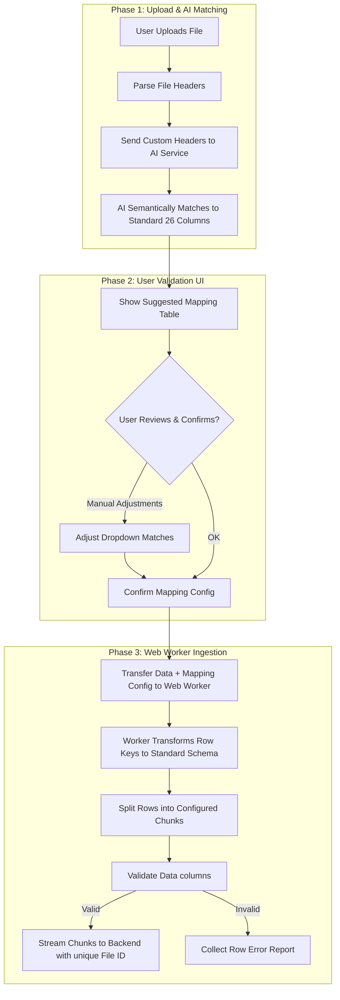

# Proof of Concept: AI-Assisted Header Mapping & Validation Pipeline

This document outlines the goal, architecture, flow, and deliverables for the **AI-Driven Dynamic Header Mapping POC**. This POC extends our production-level static file validation process to handle dynamic, arbitrarily structured supplier files.

---

## 🎯 POC Goal

In the current production system (documented in [project_status.md](file:///d:/Study/SmartBridge/project_status.md)), we expect a rigid 26-column template. Any header deviation halts validation.

The objective of this POC is to:
1. **Remove the Rigid Template Constraint**: Allow users to upload files in unknown/arbitrary layouts.
2. **Leverage AI Semantic Understanding**: Match custom headers (e.g. `Supplier`, `ZIP`, `Tel. #`) to our 26 static destination columns.
3. **Keep the User in Control**: Present an interactive, high-fidelity mapping review board to confirm matches before invoking the validation web worker.
4. **Demonstrate Web Worker Integration**: Perform mapping re-indexing and data chunk validation off the main UI thread.

---

## 🏗️ POC Architecture & Flow

The pipeline operates in three distinct phases: **Extraction & AI Mapping**, **User Confirmation**, and **Worker Ingestion**.

---

## 📦 Key Deliverables for the POC

### 1. Simulated AI Mapping Utility (`ai-mock-mapper.js`)
- A service component mimicking an LLM API call.
- Receives dynamic source headers (which can be in any language, e.g. `Lief.-ID`, `Proveedor Num`) and returns a mapping configuration JSON.
- Simulates semantic matching logic to invariant target keys:
  - `"Vendor ID"` or `"Supplier Number"` or `"Lief.-ID"` $\rightarrow$ `"supplier_id"`
  - `"Supplier Legal Name"` or `"Company Name"` or `"Razon Social"` $\rightarrow$ `"supplier_legal_name"`
  - `"Zip Code"` or `"Postal"` or `"ZIP"` $\rightarrow$ `"postal_code"`
- Introduces medium/low confidence tags and unmapped items to test the UI's interactive error handling.

### 2. High-Fidelity UI Layout (Single-Page App)
- **File Upload Area**: Drag-and-drop file select container.
- **AI Mapping Confirmation Dashboard**:
  - Displays a clean visual mapping table: *Source Column $\rightarrow$ Target Column*.
  - Color-coded status labels: 🟢 **High Match** (auto-approved), 🟡 **Medium Match** (requires review), 🔴 **Unmapped** (user must select target from a dropdown).
  - **Column Merging UI Controls**: Visual interface allowing users to group multiple source columns (e.g. `first_name` + `last_name` or `city` + `state`) and assign them to a single target field.
  - Collapsible panels for viewing the original parsed data structure.
- **Validation Engine Controls**:
  - Configurable chunk size input (default: 500 rows).
  - Validation execution progress indicator showing processed chunks and speeds.
- **Error Inspector Dashboard**: Detail table containing row number, field name, values, and specific error rules violated.

- **Dedicated Ingestion Web Worker (`validation-worker.js`)**:
  - Runs in a background thread to prevent UI freeze during large file imports.
  - Handles row-by-row key transformation: maps dynamic keys to standard keys based on the confirmed mapping schema (supporting 1:1 mapping and joining multiple columns via configured separators).
  - Conducts the 26-column type and validation rules (as specified in production [project_status.md](file:///d:/Study/SmartBridge/project_status.md)).
  - Chunks and packages the clean rows into requests, transmitting them with a unique correlation `fileId`.

---

## 📋 Detailed Work Items

### 1. Frontend Tasks (React)
- **Header Normalization & Detection**: Scan the first 5-10 rows of the file to auto-detect the header row index using keyword density and filled ratio, normalise the text (lowercase and trimmed spaces) to standardise columns.
- **Secure Data Masking**: Extract 10 fully populated data rows and replace PII or financial details with generic placeholders.
- **Template Hash Generation**: Join the normalized headers into a single string and generate a unique SHA-256 hash code.
- **Review Confirmation UI**: Build a screen showing the 25 system fields matched against Excel columns with correction dropdowns and **column merging controls** (enabling users to join multiple source fields to one target field).

### 2. Backend & Cache Tasks
- **Database Schema Creation**: Design a table to store the unique template hash, raw headers, and approved 25-column mapping (supporting single keys or stringified arrays of merged keys).
- **Cache Lookup Middleware**: Create a service to search the database by hash and instantly return existing mappings.
- **AI Integration Pipeline**: Connect to the LLM using structured outputs, passing the 25 field descriptions and masked samples (invoked only if template hash lookup returns empty).
- **Multilingual System Prompt**: Write system instructions detailing field meanings and explicitly enabling cross-language mapping logic.
- **Mapping Persistence API**: Build an endpoint to save the verified mapping and template hash after user approval.
