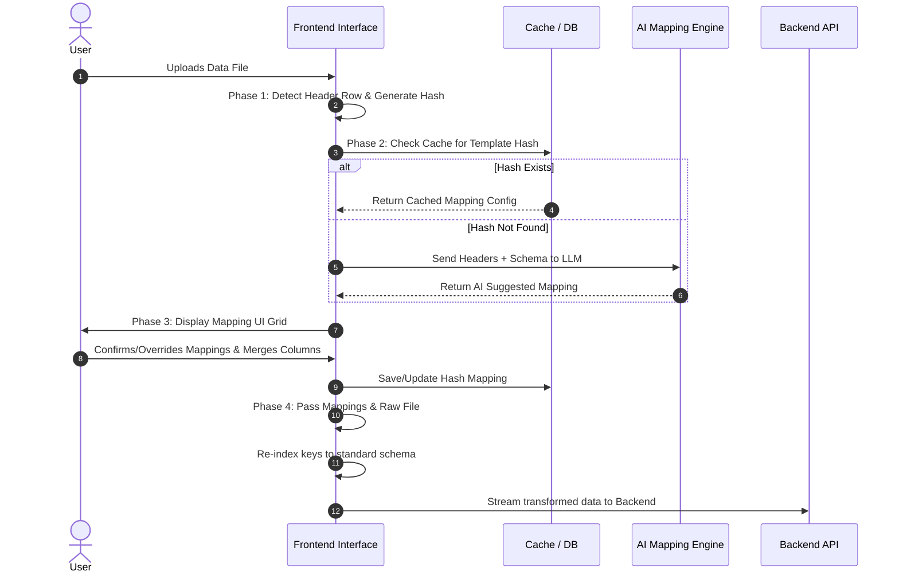

# SmartBridge File Upload & Mapping Pipeline: Detailed Requirements

## 1. Project Overview & Context
The SmartBridge platform regularly ingests large volumes of supplier and vendor data. The current objective is to model and implement a robust, highly responsive client-side parsing and ingestion pipeline. 

Historically, data ingestion relied on a rigid 26-column static template, which created significant friction during supplier onboarding—requiring manual data manipulation by the users before upload. By moving the parsing and mapping logic to the client-side UI, we achieve two major benefits:
1. **Immediate Feedback**: Users don't have to wait for a server upload to find out their file format is incorrect; issues are handled interactively.
2. **Reduced Server Load**: The backend API only receives clean, normalized, and pre-mapped data payloads ready for database insertion, bypassing heavy server-side processing.

## 2. Target Header Specifications
The SmartBridge backend system ultimately requires a strict 26-column schema to process financial and vendor metrics correctly. Regardless of what the supplier uploads, the frontend pipeline must transform the data to perfectly match these expected data types and column requirements.

| # | Column Header | Data Type | Requirement | Example Value |
|---|---|---|---|---|
| **1** | `Supplier ID` | Alphanumeric | **Mandatory.** | `SUP-12847` |
| **2** | `Supplier Name` | String | **Mandatory.** | `Global Logistics Inc` |
| **3** | `Supplier Alias` | String | **Optional.** | `GlobalLog` |
| **4** | `Supplier Legal name` | String | **Mandatory.** | `Global Logistics Systems LLC` |
| **5** | `Street Address` | String | **Mandatory.** | `742 Evergreen Terrace` |
| **6** | `City State` | String | **Mandatory.** | `Springfield, OR` |
| **7** | `Potal Code` *(Postal)* | Alphanumeric | **Mandatory.** | `97477` |
| **8** | `Country` | String | **Mandatory.** | `US` |
| **9** | `Phone Number` | String | **Mandatory.** | `+1-541-555-0199` |
| **10**| `Email Address` | String | **Mandatory.** | `contact@globallogistics.com` |
| **11**| `Tax Id` | String | **Mandatory.** | `12-3456789` |
| **12**| `Payment Terms` | String | **Mandatory.** | `Net 30` |
| **13**| `Payment Method` | String | **Mandatory.** | `ACH` |
| **14**| `Currency` | String | **Mandatory.** | `USD` |
| **15**| `Total Number of Invoices` | Integer | **Mandatory.** | `120` |
| **16**| `Total Number of Purchase Orders` | Integer | **Mandatory.** | `45` |
| **17**| `Total Number of Payments Paid` | Integer | **Mandatory.** | `95` |
| **18**| `Total Number of Paymnets Due` | Integer | **Mandatory.** | `20` |
| **19**| `Total Number of Payments open` | Integer | **Mandatory.** | `5` |
| **20**| `Transaction Count` | Integer | **Mandatory.** | `165` |
| **21**| `Total Amount of Invoices` | Decimal | **Mandatory.** | `240500.75` |
| **22**| `Total Amount of Purchase Orders` | Decimal | **Mandatory.** | `195000.00` |
| **23**| `Total Amount of Payments Paid` | Decimal | **Mandatory.** | `180000.50` |
| **24**| `Total Amount of Payments Due` | Decimal | **Mandatory.** | `55500.25` |
| **25**| `Total Amount of Payments Open` | Decimal | **Mandatory.** | `5000.00` |
| **26**| `Annual Target Spend` | Decimal | **Mandatory.** | `500000.00` |

## 3. New Requirement: AI-Driven Header Mapping
To eliminate the friction of manual template formatting, we are introducing an AI-assisted dynamic mapping layer. 
Suppliers often provide data in various structures, featuring proprietary, custom, or translated column headers (e.g., `Vendor Num`, `Legal Entity`, `ZIP`, `Tel`, or `Lieferanten-ID`). 

**Core Value Proposition**: Rather than forcing suppliers to adhere strictly to our 26-column template, this workflow seamlessly analyzes the uploaded file, identifies the true header row, and utilizes Large Language Models (LLMs) to semantically map custom source headers to our 26 static target headers. This drastically reduces onboarding time and accommodates global suppliers using localized data exports.

## 4. End-to-End Workflow Architecture
This sequence outlines the exact data journey from the moment the user drops a file into the browser, through the AI mapping phase, and finally streaming the transformed data to the backend.

## 5. Detailed Workflow Phases

### Phase 1: User Upload & Header Detection
**Goal:** Ingest the raw file securely, programmatically locate the column headers, and generate a unique fingerprint for caching.

- **File Upload Area**: A responsive drag-and-drop container accepting standard data formats (`.csv`, `.xlsx`, `.xls`). It handles initial file-size validations and uses client-side libraries (like PapaParse or SheetJS) to read the raw data into memory.
- **Dynamic Header Row Detection (Multilingual Heuristics)**:
  Often, files contain metadata (like "Report Generated On...") in the first few rows. The system must find the real headers:
  - **Data Type Density Analysis**: The system analyzes each row. The actual header row is programmatically identified as the transition point where cell values are almost exclusively text labels (the headers), immediately followed by rows containing structured, varied data types (numbers, decimals, dates, ISO codes).
  - **Manual Offset Override**: If the heuristic fails, the UI falls back to a visual row selector. It displays the first 10 rows of the file, allowing the user to simply click the row that contains their actual headers.
- **Header Normalization**: To ensure consistent hashing, extracted headers are aggressively trimmed of whitespace, stripped of special characters, and converted to lowercase.
- **Template Hash Generation**: The normalized headers are concatenated into a single string and hashed using SHA-256. This hash acts as a unique fingerprint for this specific file structure.
- **Secure Data Masking (Privacy First)**: Before any data leaves the browser to hit the LLM, the system extracts 10 sample data rows and masks sensitive PII or financial details (e.g., replacing real emails with `user@example.com`, or real financial totals with `999.99`). This ensures compliance with global privacy standards like GDPR and CCPA.

### Phase 2: Cache Check & AI Mapping Engine
**Goal:** Rapidly determine the mapping configuration. We prioritize cache lookups to save time and API costs, only falling back to AI when encountering a brand-new format.

- **Cache Lookup Middleware**: 
  - The client queries the SmartBridge database using the SHA-256 template hash.
  - **Cache Hit**: If this supplier (or any other user) has uploaded this exact file structure before, the database returns the previously approved mapping configuration, instantly skipping the AI phase and proceeding to UI review.
- **AI Integration Pipeline (Cache Miss)**: 
  - If the hash is unknown, the system connects to the LLM via a structured API output schema.
  - **Payload**: The prompt includes the detected custom headers, the masked sample data rows, and the semantic descriptions of our 26 invariant target slugs.
  - **Multilingual Semantic Matching**: The AI is instructed to semantically match headers regardless of language. For example, it understands that `Nombre de proveedor` (Spanish) maps directly to our `supplier_name` requirement.
- **Expected AI Response**:
  - The AI returns a JSON object mapping source columns to target slugs, alongside a **Confidence Score**.
  - It explicitly flags high-confidence matches (>90%), medium matches (70-89%), and explicitly lists any source columns it could not map at all (Unmapped).

### Phase 3: Mapping Review & Column Merging UI
**Goal:** Maintain a "Human in the Loop" to ensure data integrity. Users verify AI suggestions, resolve ambiguities, and handle complex data merges before any data reaches the backend.

- **Visual Mapping Grid**: A split-pane or card-based UI. The left side shows the uploaded Source Columns (with sample data), and the right side shows the Suggested Target Slugs. The UI dynamically translates the target slugs into the user's active browser language for ease of understanding.
- **Confidence Indicators**:
  - 🟢 **High Match**: Auto-paired. Requires no user action but remains fully editable.
  - 🟡 **Medium Match**: Flagged with a warning icon, prompting the user to explicitly verify the AI's guess before proceeding.
  - 🔴 **Unmapped**: Left blank. The user must manually open a dropdown and select the correct target header.
- **Advanced Column Merging UI Controls**: 
  - Sometimes, a supplier splits data that we expect combined. 
  - **Example**: The uploaded file has `First Name` and `Last Name` in two separate columns. The user can click a "Merge" icon, select both source columns, assign them to our `supplier_name` target, and choose a separator (like a Space or a Comma).
- **Mapping Persistence**: Once the user clicks "Confirm Mapping", the finalized mapping configuration is saved to the backend database, permanently associated with the SHA-256 template hash for future rapid lookups.

### Phase 4: Data Transformation & Ingestion
**Goal:** Process the entire file payload efficiently in the browser, applying the confirmed mapping rules, and safely transmitting the standardized data.

- **Row Transformation (Re-indexing)**:
  - The client-side application iterates through every data row in the parsed file.
  - It constructs a new JSON object for each row. Dynamic source keys are replaced with our 26 invariant programmatic slugs based on the user-confirmed mapping.
  - It executes any user-defined column merges on the fly (e.g., concatenating string components into a single target field).
  - Any uploaded source columns that were not mapped to our 26 targets are safely discarded to save bandwidth.
- **Streaming & Payload Delivery**:
  - To prevent browser memory crashes or backend API timeouts on massive files, the re-indexed JSON array is streamed to the backend sequentially.
  - Every batch is tagged with a unique `File ID` generated during Phase 1, allowing the backend to stitch the upload together seamlessly and track progress.

## 6. Edge Cases & Risk Mitigation
Robust error handling is required to ensure the ingestion pipeline doesn't break under unusual conditions.

| Edge Case Scenario | System Action / Mitigation |
|---|---|
| **Multiple source columns map to the same target** | The UI displays a collision warning (e.g., "Both 'Zip' and 'Postal' mapped to `postal_code`"). The submit button is disabled until the user resolves the duplicate. |
| **Mandatory target columns are not mapped** | The UI explicitly flags missing mandatory columns (like `Supplier ID`). The user cannot proceed to ingestion until these are resolved or merged. |
| **AI service timeout / downtime** | The system gracefully falls back to a completely manual mapping UI. The user pairs source headers to target headers using standard drag-and-drop lists without AI suggestions. |
| **Blank or Null Headers in source file** | The extraction phase autogenerates placeholder headers (e.g., `Column_A`, `Column_B`) so the user can still select and map that column's data. |
| **Massive Files freezing the UI** | If processing exceeds standard limits, the UI implements pagination or asynchronous batching for the Row Transformation step to keep the browser responsive. |

## 7. Appendix: Invariant Programmatic Slugs

To prevent localized UI titles (e.g., "Nom du fournisseur" in French) from breaking the backend JSON parser, the AI and the frontend strictly map all source headers to these invariant, English-based programmatic slugs. The UI handles translating these slugs for display purposes only.

| Invariant Slug | Expected Data Type | Requirement |
|---|---|---|
| `supplier_id` | Alphanumeric | Mandatory |
| `supplier_name` | String | Mandatory |
| `supplier_alias` | String | Optional |
| `supplier_legal_name` | String | Mandatory |
| `street_address` | String | Mandatory |
| `city_state` | String | Mandatory |
| `postal_code` | Alphanumeric | Mandatory |
| `country` | String | Mandatory |
| `phone_number` | String | Mandatory |
| `email_address` | String | Mandatory |
| `tax_id` | String | Mandatory |
| `payment_terms` | String | Mandatory |
| `payment_method` | String | Mandatory |
| `currency` | String | Mandatory |
| `total_invoices` | Integer | Mandatory |
| `total_purchase_orders` | Integer | Mandatory |
| `total_payments_paid` | Integer | Mandatory |
| `total_payments_due` | Integer | Mandatory |
| `total_payments_open` | Integer | Mandatory |
| `transaction_count` | Integer | Mandatory |
| `total_amount_invoices` | Decimal | Mandatory |
| `total_amount_purchase_orders` | Decimal | Mandatory |
| `total_amount_payments_paid` | Decimal | Mandatory |
| `total_amount_payments_due` | Decimal | Mandatory |
| `total_amount_payments_open` | Decimal | Mandatory |
| `annual_target_spend` | Decimal | Mandatory |
